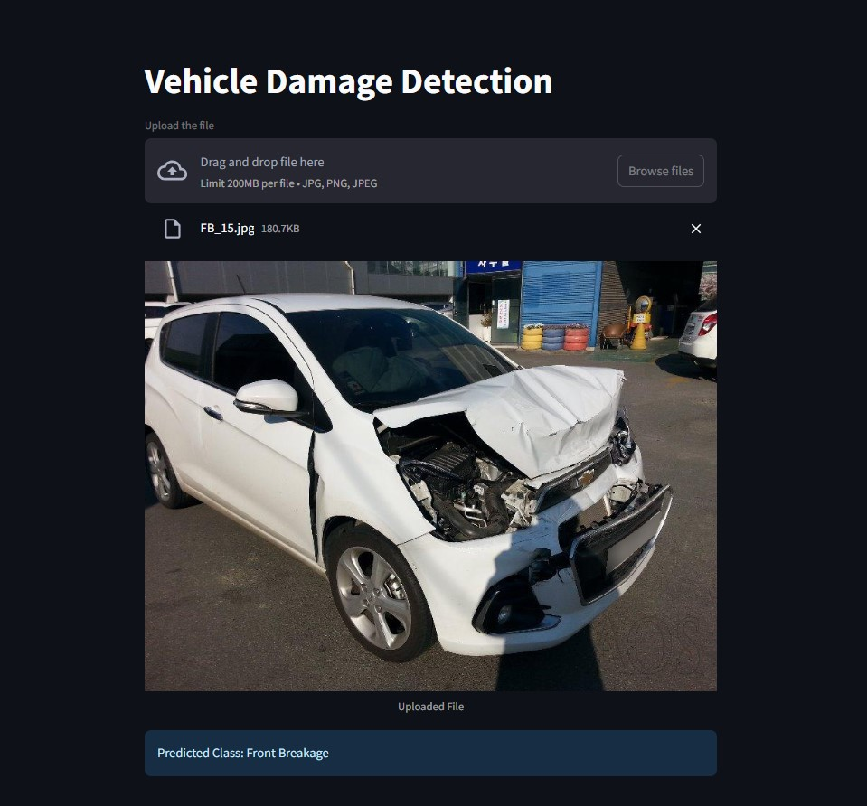

# Vehicle Damage Detection App

## Overview

This application allows users to upload an image of a car and identify the type of damage it has sustained. The model has been specifically trained on third-quarter front and rear views of vehicles, so images should capture these angles for optimal performance.



---

## Motivation

Accurate and automated vehicle damage detection is crucial for:

- Streamlining insurance claims and assessment processes.
- Providing a quick and objective damage evaluation.
- Reducing manual inspection efforts and associated costs.

This project addresses these needs using machine learning and computer vision techniques.

---

## Goals

1. **Develop a reliable machine learning pipeline** to classify vehicle damages.
2. **Leverage transfer learning techniques** to overcome data scarcity.
3. **Build a user-friendly application** for efficient damage detection.

---

## Project Structure

The repository is organized as follows:

### 1. **Main Files**

- `app.py`: The main Streamlit application for user interaction and damage detection.
- `model_helper.py`: Contains helper functions for loading models and making predictions.

### 2. **Artifacts**

- `saved_model.pth`: The pre-trained model used for predictions.

### 3. **Code**

- `damage_prediction.ipynb`: Contains the code for training the damage detection model.
- `hyperparameter_tuning.ipynb`: Includes hyperparameter optimization experiments using Optuna.

---

## Technical Aspects

### Data Preprocessing and Augmentation

- The dataset consisted of approximately 1,700 images with six target classes:
  1. Front Normal
  2. Front Crushed
  3. Front Breakage
  4. Rear Normal
  5. Rear Crushed
  6. Rear Breakage

- Data augmentation techniques such as rotation, flipping, and scaling were applied to artificially expand the dataset and improve model generalization.

### Model Development and Selection

1. **Baseline Models**:
   - Simple Convolutional Neural Networks (CNNs) were initially tested.
   - Regularization techniques like dropout were added to improve generalization.
   - However, due to the limited dataset, the accuracy of these models was suboptimal.

2. **Transfer Learning**:
   - Pre-trained models such as ResNet50 and EfficientNet were fine-tuned on the dataset, significantly improving accuracy and convergence speed.

3. **Hyperparameter Tuning**:
   - Hyperparameters were optimized using Optuna, as documented in the `hyperparameter_tuning.ipynb` notebook. This process included tuning learning rates, batch sizes, and optimizer parameters.

### Final Model Performance

- The ResNet50 model was finalized due to its superior performance.
- Achieved approximately 80% accuracy on the validation set.

### Libraries and Tools

- **Python**: Programming language for all scripts and notebooks.
- **Libraries**:
  - `torch` and `torchvision`: Deep learning framework and models.
  - `scikit-learn`: Evaluation metrics and preprocessing.
  - `streamlit`: Web app deployment.
  - `Optuna`: Hyperparameter optimization.
  - `matplotlib` and `seaborn`: Data visualization and analysis.
- **Tools**:
  - Jupyter Notebook for development and experimentation.
  - Streamlit for deployment.

---

## Setup

### Dependencies Installation

Ensure you have Python installed. Clone the repository and run the following commands to install dependencies:

```bash
# Clone the repository
git clone https://github.com/NDN-Surya/CAR-DAMAGE-DETECTION.git

# Navigate to the project directory
cd CAR-DAMAGE-DETECTION

# Install dependencies
pip install -r requirements.txt
```

### Running the App

To start the Streamlit app:

```bash
streamlit run app.py
```

---

## Future Enhancements

- Expanding the dataset to improve generalization.
- Testing additional pre-trained models for potential accuracy gains.
- Enhancing the user interface for better usability.

---

Feel free to contribute or raise issues for further improvements!

